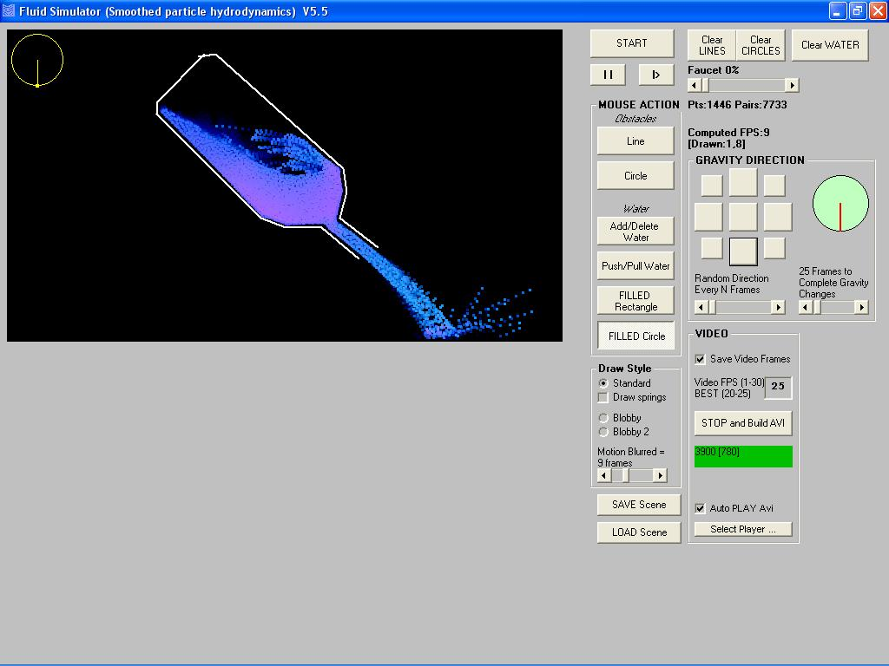



## Fluid Simulator \(Smoothed Particle Hydrodynamics\)  V5\.5

### Description

Fluid Simulator (Smoothed Particle Hydrodynamics) V5.5 [Update: FASTER]

Add Filled Circle - Motion Blur - Blobby2 Draw Style - Customizable Gravity. Old Features: - Add water Filled Rectangle - Blobby Draw Style. Based on this paper: http://www.iro.umontreal.ca/labs/infographie/papers/Clavet-2005-PVFS/pvfs.pdf. Suggestions to make the fluid looks more water-like are appreciated. (line line intersect) (Point distance from line)
 
### More Info
 

             |
---                |---
**Submitted On**   |2011-06-21 12:01:26
**By**             |[reexre](https://github.com/Planet-Source-Code/PSCIndex/blob/master/ByAuthor/reexre.md)
**Level**          |Intermediate
**User Rating**    |5.0 (65 globes from 13 users)
**Compatibility**  |VB 6\.0
**Category**       |[Miscellaneous](https://github.com/Planet-Source-Code/PSCIndex/blob/master/ByCategory/miscellaneous__1-1.md)
**World**          |[Visual Basic](https://github.com/Planet-Source-Code/PSCIndex/blob/master/ByWorld/visual-basic.md)
**Archive File**   |[Fluid\_Simu2206766212011\.zip](https://github.com/Planet-Source-Code/reexre-fluid-simulator-smoothed-particle-hydrodynamics-v5-5__1-73110/archive/master.zip)

